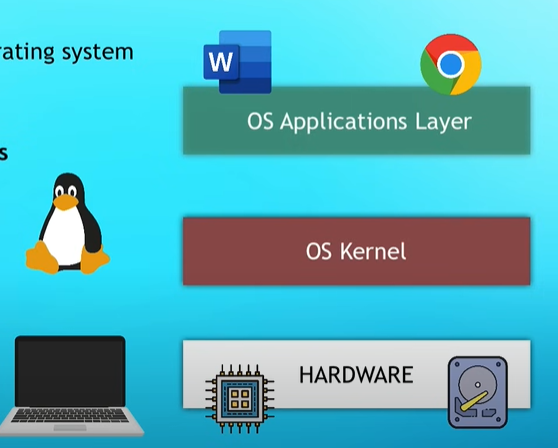

# Docker Overview

## 1. What is Docker?

- Virtualization tool - to create standard isolated envoirnments.
- Docker is a containerization platform that allows you to build, deploy, and manage containerized applications.
- Containers encapsulate an application and its dependencies, ensuring consistent and reproducible deployments across environments.



```
Docker contains OS application layer, and uses host kernel to communicate with the hardware part of the system.
VM (or virtualization) however has it's own Application layer and it's own kernel, hence it virtualises the whole OS.

Docker was originally designed for Linux and later improvised as a Docker Desktop to be run on any OS.
It uses a hypervisor layer with a light weight linux ditribution.
Hypervisor Layer - a software layer that enables one host computer to simultaneously support multiple VMs.
```

## 2. Key Concepts:

- **Image:** A lightweight, standalone, and executable package that includes everything needed to run an application, such as code, runtime, libraries, and system tools.
- **Container:** An instance of an image, running as a process isolated from the host system.

## 3. Benefits:

- **Portability:** Containers run consistently across different environments, from development to production.
- **Isolation:** Containers provide process and resource isolation, ensuring applications don't interfere with each other.
- **Efficiency:** Containers share the host OS kernel, reducing overhead and resource usage compared to traditional virtualization.

## 4. Docker Components:

- **Docker Engine:** Core technology responsible for building, running, and managing containers.
- **Docker CLI:** Command-line interface for interacting with Docker.
- **Docker Hub:** A cloud-based registry for sharing and managing Docker images.
- **Docker Compose:** Tool for defining and running multi-container Docker applications using a YAML file.

## 5. Basic Commands:

- `docker pull`: Fetches an image from Docker Hub.
- `docker build`: Builds a Docker image from a Dockerfile.
- `docker run`: Creates and starts a container based on an image.
- `docker ps`: Lists running containers.
- `docker stop`, `docker start`: Stops and starts containers.

## 6. Dockerfile:

- A script containing instructions to build a Docker image.
- Defines the base image, application code, dependencies, and runtime settings.

## 7. Orchestration (Optional):

- **Docker Swarm:** Native clustering and orchestration solution for Docker.
- **Kubernetes:** Container orchestration platform supporting Docker, widely used for managing containerized applications.
```
This is how they are related together. Docker builds container that can be managed (or orchestrated, 👀) using Kubernetes.
```

## 8. Use Cases:

- **Microservices:** Docker facilitates the development and deployment of microservices architectures.
```
Microservices: Microservices is an architectural style for developing software applications.
Applications are composed of small, independent services that communicate through well-defined APIs.

⭐ Now where does docker help?
It can provide containers for all these small services required by Application.
```

- **DevOps:** Enables consistent environments for development, testing, and production.
- **Continuous Integration/Continuous Deployment (CI/CD):** Docker containers streamline the deployment pipeline. 
```
Saves large chunk of time that used to go into resource planning and dependency setup.
```

## 9. Security:

- Containers are isolated, but security best practices should be followed.
- Regularly update base images, avoid running as root, and implement network segmentation.

## 10. Docker & Airflow

- Can use Docker containers to package, distribute, and run Apache Airflow and its associated dependencies. 
- We create Docker images that encapsulate Apache Airflow, its dependencies, and the specific configurations required for a given workflow.
- Docker provides a consistent environment for Airflow, making it easier to manage dependencies, versions, and deployment across different environments. 


