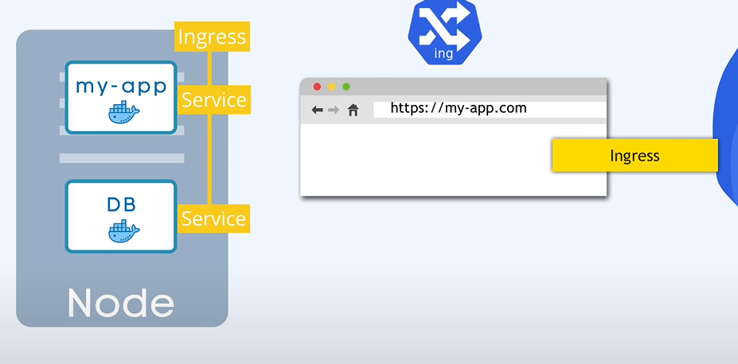

# Kubernetes Overview

## What is Kubernetes?

- **Kubernetes (K8s):** An open-source container orchestration platform.
- Manages the deployment, scaling, and operation of containerized applications.


```
Orchestration comes from orchestra, where it means to manage variety of components together. 

With extensive use of containerization, orchestration helps managing and coordinating various containers, to work together seamlessly in an application. 

Kubernetes, as an orchestrator, plays a role similar to that of a conductor in an orchestra, ensuring that containers are deployed, scaled, and operated efficiently to deliver a well-orchestrated and functioning system.
```

### Features:

- **Scalability:** Easily scales applications up or down.
- **Self-Healing:** Restarts failed containers and replaces unhealthy ones.
- **Rolling Updates:** Updates applications without downtime.
- **Storage Orchestration:** Manages storage systems and automates mounting.
- **Service Discovery and Load Balancing:** Enables communication between services.

### Kubernetes Ecosystem:

- **Helm:** Package manager for Kubernetes applications.
- **Prometheus:** Monitoring and alerting toolkit.
- **Fluentd:** Data collector for unified logging.
- **Istio:** Service mesh for connecting, monitoring, and securing services.

### Benefits:

- **Portability:** Works across on-premises, public, private, and hybrid cloud environments.
- **Resource Efficiency:** Optimizes resource utilization through containerization.
- **Declarative Configuration:** Describes the desired state, and Kubernetes ensures it.
- **Scalability:** Easily scales applications up or down.
- **Self-Healing:** Restarts failed containers and replaces unhealthy ones.
- **Rolling Updates:** Updates applications without downtime.
- **Storage Orchestration:** Manages storage systems and automates mounting.
- **Service Discovery and Load Balancing:** Enables communication between services.

## Key Concepts:
 
### 1. Nodes:

- **Nodes:** The physical or virtual machines that run your applications.
- Each node in a Kubernetes cluster can host multiple containers.

### 2. Pods:

- **Pods:** The smallest deployable units in Kubernetes.
- One or more containers can run in a pod, sharing the same network and storage.
- this is what gets deployed on nodes for execution.

### 3. Services:

- **Services:** Provide a stable endpoint to access a group of pods.
- provides a permanent ip address (endpoints) to pods.
- Enables load balancing and automatic service discovery.
- takes request for app and will redirect to whichever pod is available, thus acting as a load balancer.

### 4. Replication Controllers:

- **Replication Controllers:** Ensure a specified number of replicas (pods) are running.
- Helps with scaling and maintaining the desired state.

### 5. Deployments:

- **Deployments:** A higher-level abstraction to manage replica sets and pods.
- we  will not be deploying pods but deployments with directly stating how many copies of that pod we want to run.
- Allows rolling updates and rollbacks.

### 6. Stateful sets
- manages which pods are reading or writing from the database.
- to avoid data inconsistency.
- replicating DB of pods is done by this.
- performs similar operation as Deployments.

### 6. ConfigMaps and Secrets:

- **ConfigMaps:** Store configuration data of dependencies that pod uses.
- **Secrets:** Store sensitive information like passwords or API keys in base 64 encoding format by default. need third party encryption.

### 7. Ingress:

- **Ingress:** Manages external access to services within a cluster.
- Acts as a traffic manager.


### 8. etcd Database:

- **etcd:** A distributed key-value store used to store configuration data.
- Holds the state of the entire Kubernetes cluster.

### 9. Load Balancing:

- **Load Balancing:** Distributes traffic among replicated pods.
- Ensures even distribution and high availability.

### 10. Replication Controller:

- **Replication Controller:** Ensures a specified number of replicas (pods) are running.
- Scales the number of replicas up or down.

### 11. Scheduler:

- **Scheduler:** Assigns pods to nodes based on resource requirements.
- Optimizes for efficiency and ensures high resource utilization.


## Kubernetes Hierarchy:

- **Cluster:** Collection of nodes that run containerized applications.
- **Master Node:** Oversees the cluster and makes decisions about the cluster state.
- **Node (Minion):** Machines where containers are deployed.
- **Pod:** Smallest deployable units, containing one or more containers.
- **Container:** Encapsulates the application and its dependencies.

## Kubernetes Architecture:

### Master-Slave Architecture:

- Kubernetes follows a **master-slave architecture**.
- **Master Node:** Manages the entire cluster.
- **Node (Minion):** Worker machines where containers run.

#### Master Node:
  - **API Server:** A container it self. Runs the Kubernetes API, UI and CLI controls.
  - **Controller Manager:** keeps track of what's happening in the cluster.
  - **Scheduler:** Assigns workloads(or containers to run) to different nodes.
  - **etcd:** Distributed key-value store for configuration data. stores current status of cluster, including each node and each container in that node.
  - **Runs handful of processes:** less requirement of resources still much more important.

*Master Node Components:*
  - **API Server:** Exposes Kubernetes API.
  - **Controller Manager:** Ensures the desired state.
  - **Scheduler:** Assigns workloads to nodes.
  - **etcd:** Distributed key-value store for configuration data.

#### Worker Node:
  - **Kubelet:** Ensures containers are running in a pod.
  - **Kube Proxy:** Maintains network rules.
  - **Container Runtime:** Software responsible for running containers (e.g., Docker).
  - **Higher Workload:** hence much bigger and has more resources.

*Worker Node Components:*
  - **Kubelet:** Ensures containers are running in a pod.
  - **Kube Proxy:** Maintains network rules.
  - **Container Runtime:** Software for running containers (e.g., Docker).

### Virtual Network

Enables all the nodes to talk to each other.
Creates one unified machine with all the individual nodes.

## Workflow:

1. **Desired State Declaration:**
   - Users declare the desired state of their applications using YAML files.

2. **API Server:**
   - Kubernetes API server processes the declaration.

3. **etcd Database:**
   - The state of the cluster is stored in the etcd database.

4. **Controller Manager:**
   - Ensures the current state matches the desired state.

5. **Scheduler:**
   - Assigns workloads to nodes based on resource requirements.

6. **Node Components:**
   - Nodes receive instructions and deploy containers.


## Conclusion:

Kubernetes simplifies the deployment, scaling, and management of containerized applications, providing a robust platform for modern, cloud-native development.